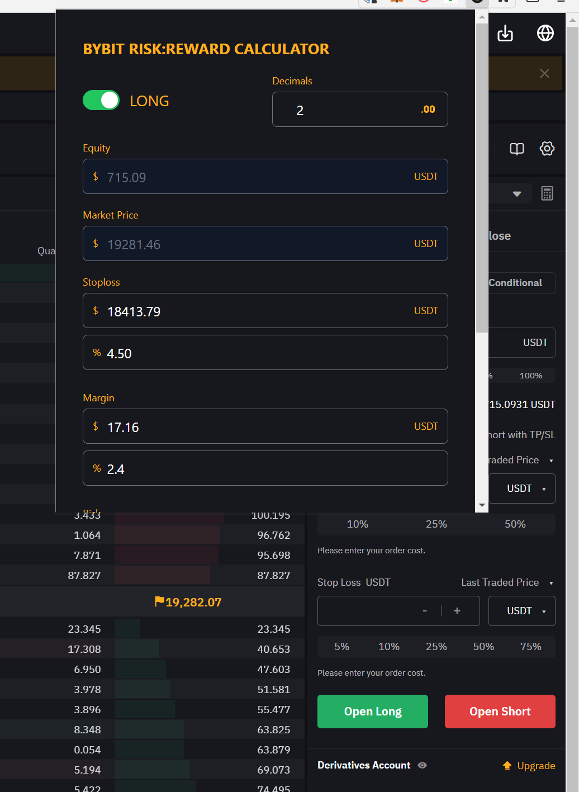

# Bybit Extension for Chrome (or Brave)

> ## This extensions helps sizing your positions to keep consistent risk and reward without the hassle.

## Features
* Automatically reads your balance and market price
* Calculates stoploss, risk and margin based on your balance
* Returns the perfect leverage for your trades in order to keep consistent risk to reward
* Does not do any kind of automation, it calculates numbers to copy and paste into your next trade

## How to use

Basically just watch this [Youtube video](https://www.youtube.com/watch?v=dqItYjkiTBY) to find out how to size your positions using this calculator.

## Support this project

This project is free of charge but coding and maintaining requires a lot of coffee. If this tool saves you time it would be awesome if you pay for my next coffee and leave a [donation](https://paypal.me/marcmintel) so I can keep going. 🙏

## Disclaimer

This project is a third party tool and not associated with Bybit. Use at your own risk. This extension only works with Bybit as it reads market data to save you time. If you are just looking for a calculator to use on any exchange you should go to [Kite's Risk Calculator](https://risk-reward-calc.netlify.app/).

## Credits

Credits go to to [Kite's Youtube Channel](https://www.youtube.com/c/KiteHD) who came up with this idea, I just ported it to a Chrome Extension so it's easier to use on Bybit.
